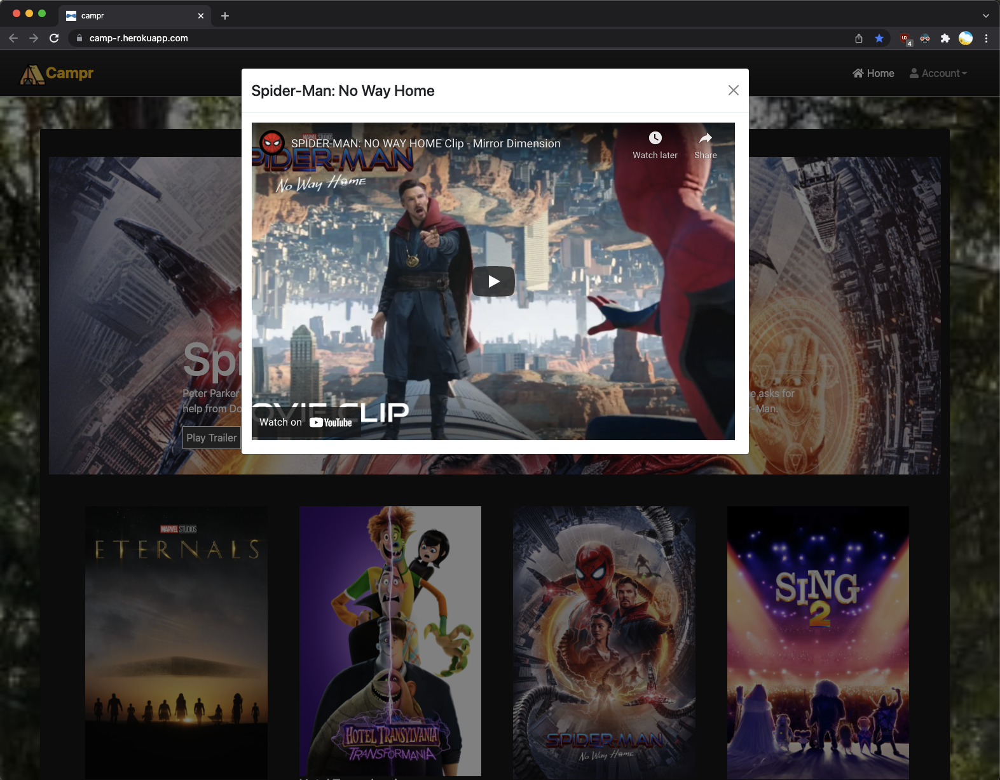

# FullStack-Campr

- Check out the application here: [`https://camp-r.herokuapp.com/`](https://camp-r.herokuapp.com/)

## App Overview

- Campr is a full stack video library application where a client can watch videos, similar to other video streaming services such as YouTube, Netflix and vice versa.
- When a client logs in, they can:
  - add videos to their favorite
  - view their watch history
  - post simple text-comments on a video

## Team Members:

Click to view each contributor's GitHub.

- [Amanda Huang](https://github.com/AmandaJ-Huang)
- [Carnell Poteat](https://github.com/c-poteat)
- [Michael Gawronski](https://github.com/mgawron8)
- [Paul Quatrani](https://github.com/quatrpau)

## Development Notes

### Tech Stack

- **UML**: [Star UML](https://github.com/CAMP-team/FullStack-Campr/blob/main/docs/uml/2022-01-04_UML-Draft-Updates.png)
- **Wireframe**: [Balsamiq](https://github.com/CAMP-team/FullStack-Campr/tree/main/docs/wireframe)
- **Frontend**: React
- **Business Logic**: Java (Spring Boot)
- **Data Layer**: Postgresql
- **Cloud**: [Heroku](https://camp-r.herokuapp.com/)

### Screenshots

#### Home Page

- Home page at a glance. No specific user is logged in here so anyone can come and watch.
  

- Clicking the "Play Trailer" in the main banner at the top will bring up a pop-up window with the trailer
  

#### Sign In

#### User Comments (WIP)

- Add a user comment
  

- User comment added
  
